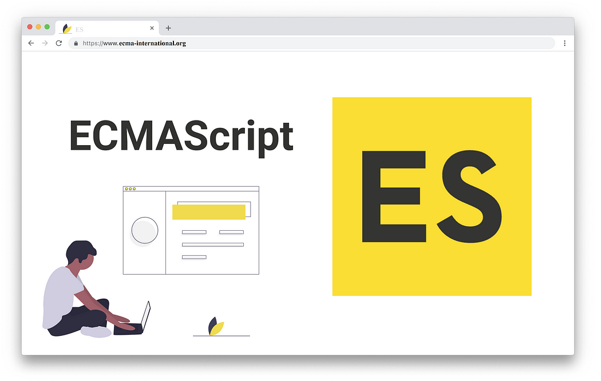

# JavaScript

- JavaScript ("JS" для краткости) — это полноценный динамический язык программирования, который применяется к HTML документу, и может обеспечить динамическую интерактивность на веб-сайтах. Его разработал Brendan Eich, сооснователь проекта Mozilla, Mozilla Foundation и Mozilla Corporation.

========================
========================

# ECMAscript

- ECMAScript 2016, также известный как ECMAScript 7, был принят в июне 2016 года. Он ввел два основных новых метода для работы с массивами: Array.prototype.includes(), который проверяет наличие элемента в массиве, и Exponentiation Operator (**), который позволяет возводить число в степень более лаконичным способом. 

- Эти изменения сделали код более читаемым и удобным для разработчиков. ECMAScript 7 стал первым обновлением после ECMAScript 2015 (ES6), что подчеркнуло переход к более частым и небольшим обновлениям стандарта. В целом, ECMAScript 7 продолжил улучшение языка, добавляя полезные функции без значительных изменений в синтаксисе.

========================
========================

- JavaScript-фреймворки представляют собой инструменты, которые упрощают разработку веб-приложений. Они предоставляют предопределенные структуры и компоненты, что позволяет разработчикам сосредоточиться на логике приложения. Одним из самых популярных фреймворков является React, который использует компонентный подход для создания пользовательских интерфейсов. Angular, в свою очередь, предлагает мощные инструменты для создания одностраничных приложений с использованием TypeScript. Vue.js отличается своей простотой и гибкостью, что делает его отличным выбором для начинающих разработчиков. Фреймворки также обеспечивают поддержку таких технологий, как маршрутизация и управление состоянием, что упрощает создание сложных приложений. Использование JavaScript-фреймворков значительно ускоряет процесс разработки и улучшает качество кода.

========================
========================

- Тип данных (data type) — это категория, которая определяет, какие значения может принимать переменная и какие операции можно выполнять с этими значениями. В программировании типы данных помогают компьютеру понять, как обрабатывать данные.

  # Основные типы данных:

1. Простые типы:
   - Числовые (например, int, float) — для хранения чисел.
   - Строки (например, string) — для хранения текстовых данных.
   - Логические (например, boolean) — для хранения значений true или false.

2. Сложные типы:
   - Массивы — коллекции элементов одного типа.
   - Объекты — структуры, содержащие пары "ключ-значение".

 - Правильный выбор типа данных важен для оптимизации памяти и    производительности программы.